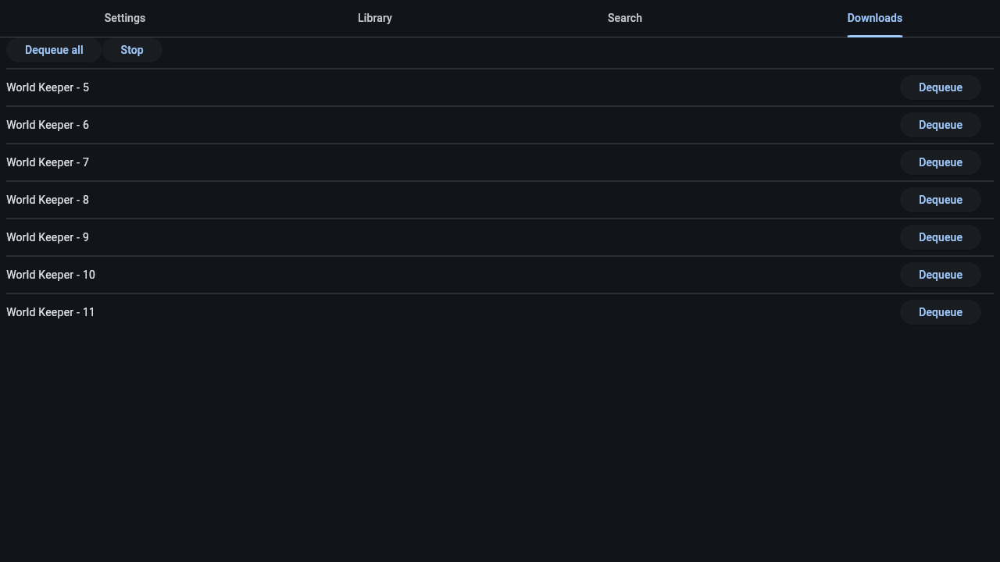
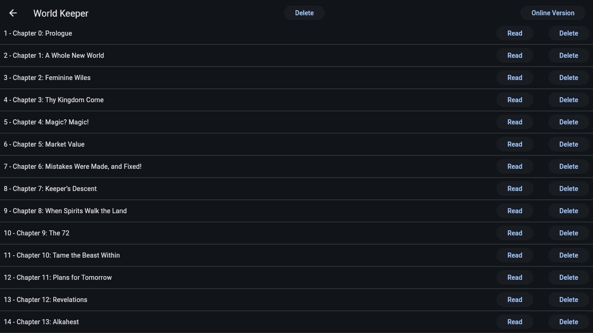

# StoryReader

A reader and offline library for ScribbleHub series.

More & full resolution screenshots

## Features

- [ ] Site support
  - [x] ScribbleHub
  - [x] RoyalRoad
  - [ ] WebNovel
  - [ ] More?
- [x] Offline library
- [x] Thumbnails
- [ ] Settings
  - [x] Customizable font size
  - [x] Maximum text width
  - [x] Turn off images to save bandwidth
  - [x] Customizable color scheme
    - [x] Light mode
- [x] Library transfer over local network
- [ ] Search
    - [x] Basic name search
    - [ ] Advanced search
- [ ] Chapter features
    - [x] Announcements
    - [x] Author notes
    - [ ] Footnotes
    - [x] Dividers
    - [x] Images
    - [x] Tables
    - [ ] Other styling options
    - [ ] Polls
- [ ] Library import via site account
- [ ] Service for background downloads on Android

## Roadmap

#### 1.0

- [x] App icon
- [x] Distribution
  - [x] FlatPak
    - [x] ...on FlatHub
  - [x] Zip archive for windows
  - [x] APK
- [x] Color scheme
- [x] Tables
- [ ] Footnotes
- [x] License page
- [ ] Merge library from network (keep all data, only add)
- [x] migrate contents to RichTextElement
  - [x] consume RichTextDocument in read_page, generate in APIs
  - [x] DB migration

#### 1.1

- [ ] Update notifications for windows
  - [ ] check GitHub releases
- [ ] f-droid
  - [ ] change id to io.github
  - [ ] create build metadata
    - orient by other flutter apps
  - [ ] test build
  - [ ] submit PR
- [ ] Android background downloads
  - [ ] Foreground service plugin
  - [ ] start/stop the service with the download manager isolate
- [x] RoyalRoad

#### 1.2

- [ ] WebNovel?
- [ ] Advanced search
- [ ] Export series as epub
  - [ ] and library as zip of epubs
- [ ] Library filter by name, tag name or genre name

#### 1.3

- [ ] loading comments
- [ ] loading reviews
- [ ] Linking site accounts
  - [ ] liking chapters
  - [ ] liking comments
  - [ ] creating comments
  - [ ] creating reviews
  - [ ] rating stories

## License

TLDR: MPLv2

